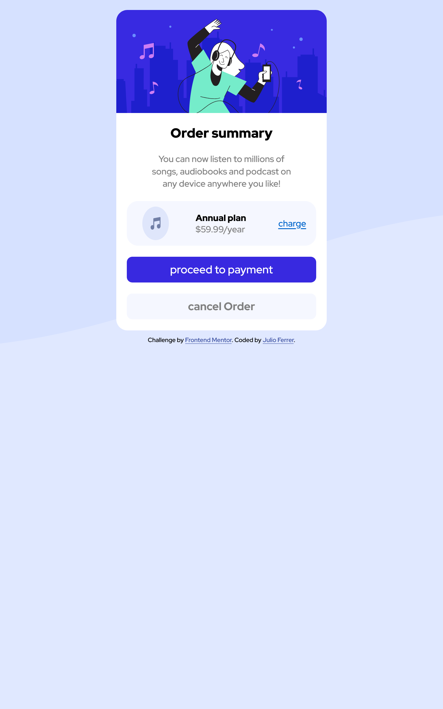

# Frontend Mentor - Order summary card solution

This is a solution to the [Order summary card challenge on Frontend Mentor](https://www.frontendmentor.io/challenges/order-summary-component-QlPmajDUj). Frontend Mentor challenges help you improve your coding skills by building realistic projects. 

## Table of contents

  - [The challenge](#the-challenge)
  - [Screenshot](#screenshot)
  - [Built with](#built-with)
  - [What I learned](#what-i-learned)
  - [Continued development](#continued-development)

### The challenge

Users should be able to:

- See hover states for interactive elements

### Screenshot

### Built with

- Semantic HTML5 markup
- Flexbox
- Mobile-first workflow

### What I learned

Improve my knowledge about flexbox and the behavior this have.

### Continued development

I'm looking forward to use grid as much I'm using flexbox right now and build new projects with both

## Author

- Website - [Add your name here](https://www.your-site.com)
- Frontend Mentor - [@Ferrer97](https://www.frontendmentor.io/profile/Ferrer97)

